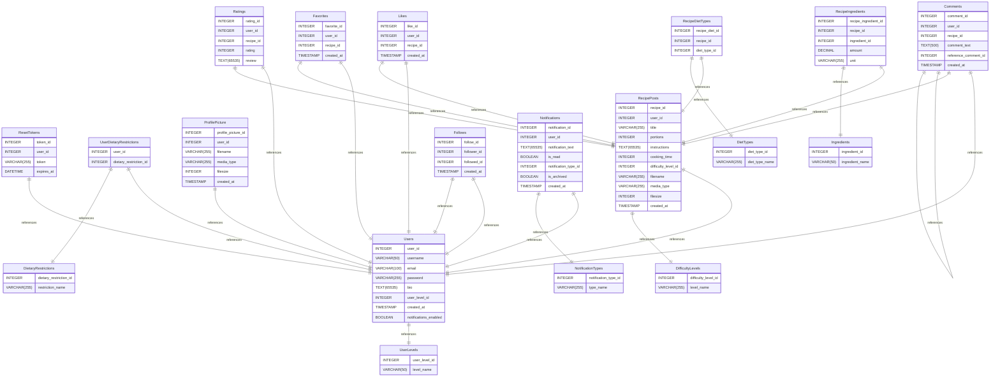

# Weedify

---

**Weedify** is a social recipe sharing application. Users can post recipes, like them, rate them, comment on them, leave reviews and save their favorite ones for easier access in the future. The application aims to lead user to healthier alternatives diet wise and doesn't
discriminate no matter what diet the user prefers.

---

## Installation
- Clone the repository in your desired directory in the terminal by running `git clone https://github.com/karripar/weedify-backend.git`<br>
- Make sure you have `Node.js` set up and run `npm install` or `npm i`<br>
- Each of the three directories have a `.env.sample` file in them. Rename the file to `.env` or copy the content to a file with the same name.
- Fill the missing database credentials with your own
- Source the `weedify.sql` script found in the project root in your MariaDB terminal.
- Run `npm run dev` in a split terminal for all three servers and have fun!
- See the apidoc documentation for detailed API query instructions.
- If `hybrid-types` are not found from the node_modules, run `npm i --save-dev github:karripar/weedify-types` to fix the issue.
<br>
<br>
NOTE:<br>

**[FFmpeg installation on Windows](https://www.wikihow.com/Install-FFmpeg-on-Windows)**<br>
- Uploading video-files might require installing ffmpeg on your windows device, follow the instructions in the link above.
- Source is already set for the files in the videoThumb.ts file in the upload-server.<br><br>

- If you're using an older version of Node.js (pre v23.6.0) see this article: **[NodeSource](https://nodesource.com/blog/Node.js-Supports-TypeScript-Natively)**.
- Running TypeScript in development mode natively works after the v23.6.0 update. If using an older one, change this part in the package.json(s)<br><br>

FROM:<br>
```json
"scripts": {
    "start": "node dist/index.js",
    "dev": "nodemon src/index.ts",
    "build": "tsc",
    "lint": "eslint --fix src test",
    "test": "jest --detectOpenHandles --forceExit",
    "apidoc": "apidoc -i src/api/routes/ -o apidocs/"
  },
``` 
<br>

TO: 

```json
"scripts": {
    "start": "node dist/index.js",
    "dev": "nodemon dist/index.js",
    "build": "tsc",
    "lint": "eslint --fix src test",
    "test": "jest --detectOpenHandles --forceExit",
    "apidoc": "apidoc -i src/api/routes/ -o apidocs/"
  },
``` 
- Now run `npm run build` for each server. After which you can use `npm run dev` normally.

---

## Links to the application, Apidoc-documentation and related repositories

### Backend Application (Azure App Services)

**[Auth API](https://ucad-server-ktp.northeurope.cloudapp.azure.com/auth/api/v1)**<br>
**[Content API](https://ucad-server-ktp.northeurope.cloudapp.azure.com/content/api/v1)**<br>
**[Upload API](https://ucad-server-ktp.northeurope.cloudapp.azure.com/uploads/api/v1)**<br>

### Apidoc-documentation (All available API endpoints):

**Detailed route definitions and specifications are found below for the three servers**<br>
**[Auth-apidoc](https://users.metropolia.fi/~karripar/weedify/apidoc/auth/)**<br>
**[Content-apidoc](https://users.metropolia.fi/~karripar/weedify/apidoc/content/)**<br>
**[Upload-apidoc](https://users.metropolia.fi/~karripar/weedify/apidoc/upload/)**<br>

### Related Repositories

**[Weedify Frontend](https://github.com/karripar/weedify-frontend)**<br>
**[Hybrid Types for TypeScript](https://github.com/karripar/weedify-types)**<br>

---

## Implementations (backend):

### Authentication (auth) related functionalities:

- User registration (email, username, password)
- User login (email, password)
- User profile management such as updating dietary preferences, profile picture, and bio text
- JWT authentication is used to secure user data encryption
- Users can delete their account, and an admins can delete any account
- Users can change their password
- Users can add and change their profile picture
- Availability check for email and username, returning an {available: boolean} object
- Admins have the right to delete users, recipes, and comments

### Content related functionalities:

- The user can create a new recipe, and it will be visible to other users on the main page
- The user can publicly rate and comment on other users’ recipes (only logged-in users)
- A logged-in user can save their favorite recipes and easily access them when opening the app
- The user can easily filter recipes, for example, based on their own special dietary needs
- The user can filter recipes using search terms
- Fetching recipes from followed users
- Users can follow each other
- Rating a recipe or following a user automatically generates a notification for the other user
- Like recipes and remove likes.

### File upload related functionalities:

- File owner or an admin can delete media files (image/video)
- Logged in users can upload media files (image/video)

---

## Software Testing

**[E2E Tests](https://github.com/karripar/weedify-backend/tree/main/content-server/test)**

- The directory includes controllers for different cases (recipes, follows, likes, auth etc.)
- Results subdirectory has a screenshot of the successful test cases

---

## Tutorials used and references

**[Nodemailer](https://mailtrap.io/blog/sending-emails-with-nodemailer/)**: For resetting users password.
**[Fineli API](https://fineli.fi/fineli/en/avoin-data?)**: Open source food database and nutritional values provided by Terveyden ja Hyvinvoinnin Laitos (THL). 
**[Fineli API Docs](https://fineli.fi/fineli/v2/api-docs)**: Fineli API documentation

---

## Known issues and problems

- Nodemailer functions correctly in terms of code, but email security measures prevent Nodemailer from sending messages through their servers (the email service does not allow remote login). This has been tested with several common email platforms and app-specific passwords intended for server-sent messages. The password reset route has been disabled, and the user receives the following message:

```json
{
    "message": "Route currently not in use (check back later)",
    "status": 404
}
```

---

# Weedify SQL-implementation
## Summary

- [Introduction](#introduction)
- [Database Type](#database-type)
- [Table Structure](#table-structure)
	- [Users](#users)
	- [UserLevels](#userlevels)
	- [RecipePosts](#recipeposts)
	- [Ingredients](#ingredients)
	- [Ratings](#ratings)
	- [Likes](#likes)
	- [Comments](#comments)
	- [RecipeIngredients](#recipeingredients)
	- [DietTypes](#diettypes)
	- [RecipeDietTypes](#recipediettypes)
	- [Follows](#follows)
	- [Favorites](#favorites)
	- [NotificationTypes](#notificationtypes)
	- [Notifications](#notifications)
	- [ResetTokens](#resettokens)
	- [DietaryRestrictions](#dietaryrestrictions)
	- [UserDietaryRestrictions](#userdietaryrestrictions)
	- [ProfilePicture](#profilepicture)
	- [DifficultyLevels](#difficultylevels)
- [Relationships](#relationships)
- [Database Diagram](#database-diagram)

## Introduction

## Database Structure

- **Database system:** MariaDB
## Table structure

### Users

| Name        | Type          | Settings                      | References                    | Note                           |
|-------------|---------------|-------------------------------|-------------------------------|--------------------------------|
| **user_id** | INTEGER | 🔑 PK, not null, unique, autoincrement |  | |
| **username** | VARCHAR(50) | not null, unique |  | |
| **email** | VARCHAR(100) | not null, unique |  | |
| **password** | VARCHAR(255) | not null |  | |
| **bio** | TEXT(65535) | null |  | |
| **user_level_id** | INTEGER | not null, default: 2 | fk_Users_user_level_id_UserLevels | |
| **created_at** | TIMESTAMP | not null, default: CURRENT_TIMESTAMP |  | |
| **notifications_enabled** | BOOLEAN | not null, default: True |  | | 


### UserLevels

| Name        | Type          | Settings                      | References                    | Note                           |
|-------------|---------------|-------------------------------|-------------------------------|--------------------------------|
| **user_level_id** | INTEGER | 🔑 PK, not null, unique, autoincrement |  | |
| **level_name** | VARCHAR(50) | not null, unique, default: User |  | | 


### RecipePosts

| Name        | Type          | Settings                      | References                    | Note                           |
|-------------|---------------|-------------------------------|-------------------------------|--------------------------------|
| **recipe_id** | INTEGER | 🔑 PK, not null, unique, autoincrement |  | |
| **user_id** | INTEGER | not null, unique | fk_RecipePosts_user_id_Users | |
| **title** | VARCHAR(255) | not null |  | |
| **portions** | INTEGER | not null |  | |
| **instructions** | TEXT(65535) | not null |  | |
| **cooking_time** | INTEGER | not null |  | |
| **difficulty_level_id** | INTEGER | not null | fk_RecipePosts_difficulty_level_id_DifficultyLevels | |
| **filename** | VARCHAR(255) | not null |  | |
| **media_type** | VARCHAR(255) | not null |  | |
| **filesize** | INTEGER | not null |  | |
| **created_at** | TIMESTAMP | not null |  | | 


### Ingredients

| Name        | Type          | Settings                      | References                    | Note                           |
|-------------|---------------|-------------------------------|-------------------------------|--------------------------------|
| **ingredient_id** | INTEGER | 🔑 PK, not null, unique, autoincrement |  | |
| **ingredient_name** | VARCHAR(50) | not null, unique |  | | 


### Ratings

| Name        | Type          | Settings                      | References                    | Note                           |
|-------------|---------------|-------------------------------|-------------------------------|--------------------------------|
| **rating_id** | INTEGER | 🔑 PK, not null, unique, autoincrement |  | |
| **user_id** | INTEGER | not null, unique | fk_Ratings_user_id_Users | |
| **recipe_id** | INTEGER | not null, unique | fk_Ratings_recipe_id_RecipePosts | |
| **rating** | INTEGER | not null |  | |
| **review** | TEXT(65535) | null |  | | 


### Likes

| Name        | Type          | Settings                      | References                    | Note                           |
|-------------|---------------|-------------------------------|-------------------------------|--------------------------------|
| **like_id** | INTEGER | 🔑 PK, not null, unique, autoincrement |  | |
| **user_id** | INTEGER | not null, unique | fk_Likes_user_id_Users | |
| **recipe_id** | INTEGER | not null, unique | fk_Likes_recipe_id_RecipePosts | |
| **created_at** | TIMESTAMP | not null |  | | 


### Comments

| Name        | Type          | Settings                      | References                    | Note                           |
|-------------|---------------|-------------------------------|-------------------------------|--------------------------------|
| **comment_id** | INTEGER | 🔑 PK, not null, unique, autoincrement |  | |
| **user_id** | INTEGER | not null, unique | fk_Comments_user_id_Users | |
| **recipe_id** | INTEGER | not null, unique | fk_Comments_recipe_id_RecipePosts | |
| **comment_text** | TEXT(500) | not null |  | |
| **reference_comment_id** | INTEGER | null | fk_Comments_reference_comment_id_Comments | |
| **created_at** | TIMESTAMP | not null |  | | 


### RecipeIngredients

| Name        | Type          | Settings                      | References                    | Note                           |
|-------------|---------------|-------------------------------|-------------------------------|--------------------------------|
| **recipe_ingredient_id** | INTEGER | 🔑 PK, not null, unique, autoincrement |  | |
| **recipe_id** | INTEGER | not null | fk_RecipeIngredients_recipe_id_RecipePosts | |
| **ingredient_id** | INTEGER | not null | fk_RecipeIngredients_ingredient_id_Ingredients | |
| **amount** | DECIMAL | not null |  | |
| **unit** | VARCHAR(255) | not null |  | | 


### DietTypes

| Name        | Type          | Settings                      | References                    | Note                           |
|-------------|---------------|-------------------------------|-------------------------------|--------------------------------|
| **diet_type_id** | INTEGER | 🔑 PK, not null, unique, autoincrement |  | |
| **diet_type_name** | VARCHAR(255) | not null, unique |  | | 


### RecipeDietTypes

| Name        | Type          | Settings                      | References                    | Note                           |
|-------------|---------------|-------------------------------|-------------------------------|--------------------------------|
| **recipe_diet_id** | INTEGER | 🔑 PK, not null, unique, autoincrement |  | |
| **recipe_id** | INTEGER | not null | fk_RecipeDietTypes_recipe_id_RecipePosts | |
| **diet_type_id** | INTEGER | not null | fk_RecipeDietTypes_diet_type_id_DietTypes | | 


### Follows

| Name        | Type          | Settings                      | References                    | Note                           |
|-------------|---------------|-------------------------------|-------------------------------|--------------------------------|
| **follow_id** | INTEGER | 🔑 PK, not null, unique, autoincrement |  | |
| **follower_id** | INTEGER | not null | fk_Follows_follower_id_Users | |
| **followed_id** | INTEGER | not null | fk_Follows_followed_id_Users | |
| **created_at** | TIMESTAMP | not null, default: CURRENT_TIMESTAMP |  | | 


### Favorites

| Name        | Type          | Settings                      | References                    | Note                           |
|-------------|---------------|-------------------------------|-------------------------------|--------------------------------|
| **favorite_id** | INTEGER | 🔑 PK, not null, unique, autoincrement |  | |
| **user_id** | INTEGER | not null | fk_Favorites_user_id_Users | |
| **recipe_id** | INTEGER | not null | fk_Favorites_recipe_id_RecipePosts | |
| **created_at** | TIMESTAMP | not null, default: CURRENT_TIMESTAMP |  | | 


### NotificationTypes

| Name        | Type          | Settings                      | References                    | Note                           |
|-------------|---------------|-------------------------------|-------------------------------|--------------------------------|
| **notification_type_id** | INTEGER | 🔑 PK, not null, unique, autoincrement |  | |
| **type_name** | VARCHAR(255) | not null, unique |  | | 


### Notifications

| Name        | Type          | Settings                      | References                    | Note                           |
|-------------|---------------|-------------------------------|-------------------------------|--------------------------------|
| **notification_id** | INTEGER | 🔑 PK, not null, unique, autoincrement |  | |
| **user_id** | INTEGER | not null | fk_Notifications_user_id_Users | |
| **notification_text** | TEXT(65535) | not null |  | |
| **is_read** | BOOLEAN | not null, default: False |  | |
| **notification_type_id** | INTEGER | not null | fk_Notifications_notification_type_id_NotificationTypes | |
| **is_archived** | BOOLEAN | not null, default: False |  | |
| **created_at** | TIMESTAMP | not null, default: CURRENT_TIMESTAMP |  | | 


### ResetTokens

| Name        | Type          | Settings                      | References                    | Note                           |
|-------------|---------------|-------------------------------|-------------------------------|--------------------------------|
| **token_id** | INTEGER | 🔑 PK, not null, unique, autoincrement |  | |
| **user_id** | INTEGER | not null | fk_ResetTokens_user_id_Users | |
| **token** | VARCHAR(255) | not null, unique |  | |
| **expires_at** | DATETIME | not null |  | | 


### DietaryRestrictions

| Name        | Type          | Settings                      | References                    | Note                           |
|-------------|---------------|-------------------------------|-------------------------------|--------------------------------|
| **dietary_restriction_id** | INTEGER | 🔑 PK, not null, unique, autoincrement |  | |
| **restriction_name** | VARCHAR(255) | not null, unique |  | | 


### UserDietaryRestrictions

| Name        | Type          | Settings                      | References                    | Note                           |
|-------------|---------------|-------------------------------|-------------------------------|--------------------------------|
| **user_id** | INTEGER | 🔑 PK, not null, unique, autoincrement | fk_UserDietaryRestrictions_user_id_Users | |
| **dietary_restriction_id** | INTEGER | 🔑 PK, not null | fk_UserDietaryRestrictions_dietary_restriction_id_DietaryRestrictions | | 


### ProfilePicture

| Name        | Type          | Settings                      | References                    | Note                           |
|-------------|---------------|-------------------------------|-------------------------------|--------------------------------|
| **profile_picture_id** | INTEGER | 🔑 PK, not null, unique, autoincrement |  | |
| **user_id** | INTEGER | not null | fk_ProfilePicture_user_id_Users | |
| **filename** | VARCHAR(255) | not null |  | |
| **media_type** | VARCHAR(255) | not null |  | |
| **filesize** | INTEGER | not null |  | |
| **created_at** | TIMESTAMP | not null, default: CURRENT_TIMESTAMP |  | | 


### DifficultyLevels

| Name        | Type          | Settings                      | References                    | Note                           |
|-------------|---------------|-------------------------------|-------------------------------|--------------------------------|
| **difficulty_level_id** | INTEGER | 🔑 PK, not null, unique, autoincrement |  | |
| **level_name** | VARCHAR(255) | not null, unique |  | | 


## Relationships

- **Users to UserLevels**: one_to_one
- **ResetTokens to Users**: one_to_one
- **UserDietaryRestrictions to Users**: one_to_one
- **UserDietaryRestrictions to DietaryRestrictions**: one_to_one
- **ProfilePicture to Users**: one_to_one
- **RecipePosts to Users**: one_to_one
- **RecipePosts to DifficultyLevels**: one_to_one
- **RecipeIngredients to RecipePosts**: one_to_one
- **RecipeIngredients to Ingredients**: one_to_one
- **RecipeDietTypes to RecipePosts**: one_to_one
- **RecipeDietTypes to DietTypes**: one_to_one
- **Comments to Users**: one_to_one
- **Comments to RecipePosts**: one_to_one
- **Comments to Comments**: one_to_one
- **Likes to Users**: one_to_one
- **Likes to RecipePosts**: one_to_one
- **Follows to Users**: one_to_one
- **Follows to Users**: one_to_one
- **Favorites to Users**: one_to_one
- **Favorites to RecipePosts**: one_to_one
- **Notifications to Users**: one_to_one
- **Notifications to NotificationTypes**: one_to_one
- **Ratings to Users**: one_to_one
- **Ratings to RecipePosts**: one_to_one

## Database Diagram

